Endeavour2
==========

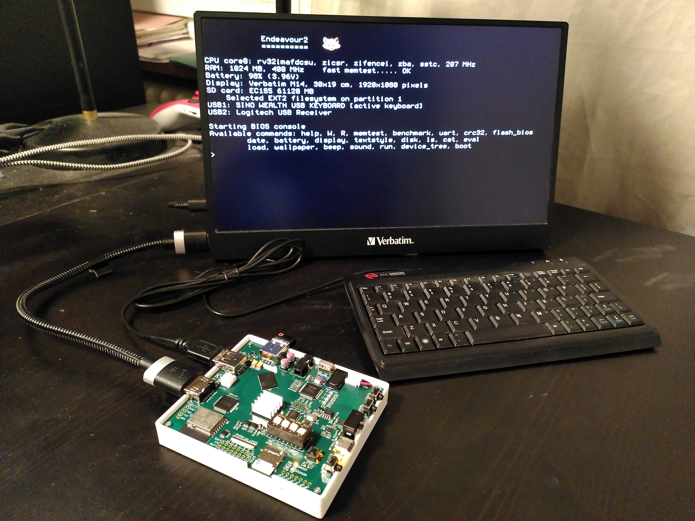

This is the second generation of my FPGA board.
Comparing to [endeavour1](https://github.com/petrmikheev/endeavour) it is 4 times faster and has 8x more memory.

The goal was the same as on the previous iteration -- to make a DIY computer based on FPGA. It should support display, keyboard, should be able to run Linux, should have on-device compiler toolchain, and ideally should be able to render some 3D graphic. It was fully achieved -- I have even managed to connect my board to WiFi and play Quake2 in multiplayer.

The project includes several parts:

- Hardware: design PCB and make the board. I ordered PCB manufacturing in JLCPCB, soldering is done manually.
- RTL: design SoC for my FPGA board. It is mostly assembled from open source IP cores, but some components are implemented from scratch.
- Firmware: written from scratch (except of integrated Dhrystone benchmark), includes initialization code, memtest, sbi implemetation, ext2 filesystem support, linux bootloader, built-in console. Provides some API (e.g printf) for software running in M-mode.
- Linux drivers for custom peripherals.
- Custom window manager and TTY implementation.

Note: This is a hobby project created just for fun. It doesn't have much practical use. However, if for some reason somebody wants to make a copy of this FPGA board, please let me know. I might add a bit more documentation.

License: GPL-3.0 (except of footprints in hardware/endeavour2.pretty and Dhrystone benchmark in software/bios/dhrystone)

## Hardware

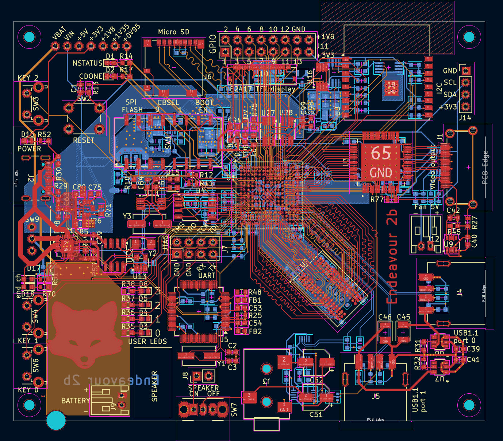

Main changes comparing to [endeavour1](https://github.com/petrmikheev/endeavour):

- This time I took a chance with BGA (Ball Grid Array) chips, and surprisingly soldering was not as hard as I expected.
- Using Efinix FPGA [Ti60F256](https://www.efinixinc.com/shop/ti60.php) with 60K logic cells and 256 1024x10b memory blocks. VexiiRiscv runs on this chip at frequency 207 MHz -- quite a lot for FPGA, especially in comparison to 60 MHz which I previously got with Altera Max10.
- 1GB DDR3 RAM IM8G16D3FFBG (against 128MB DDR1 in endeavour1). I use Efinix DDR3 Soft Controller Core. Using DDR3-400 mode, 800 MT/s, max theoretical throughput 1.6 GB/s. In practice in benchmarks I get up to 1.1 GB/s.
- Implemented SD Card voltage switch 3.3V/1.8V. In theory it allows to use UHS-1 cards in SDR104 mode (up to 100 MB/s), but for some cards writes failed at this speed, so I use SDR50 (46 MB/s in benchmark).
- Added a specialized TMDS encoder TFP410 (in endeavour1 video output was driven directly by FPGA pins which provided not enough current and caused green artifacts in some cases). Now all display modes with pixel rate up to 165 MHz are supported.
- More capacitors and a current limiting scheme on USB ports. USB hotplug can not cause device reset anymore!
- Added a real time clock in order not to appear in 1970 every time I start linux.
- Added ESP32 module as a WiFi adapter. `wget` shows download speed 926 KB/s.
- Added 2000mAh LiPo battery. 
- Added 4.2'' E-Ink display.

[KiCad project](hardware/board_2b), [gerber files](hardware/board_2b/production/endeavour2.zip).

**PCB production details ([JLCPCB](https://jlcpcb.com/capabilities/pcb-capabilities))**

- 6 layers
- Stackup: JLC06161H-3313
- Min via hole/diameter: 0.2/0.35mm
- Via covering: epoxy filled & capped

---

Endeavour2a (above) and Endeavour2b (below).

### Known design errors

In Endeavour2a:

- D+ and D- lines on USB-C port A are accidentally swapped, so port A can be used only as a power source. There are two USB-C ports because I was not sure that USB connection to PC will give enough power, and added a second USB-C for a power adapter. It turned out to be unnecessary, so in Endeavour2b the second port is removed.
- ESP32 connection scheme includes not all the pins which are needed for [ESP-Hosted-NG](https://github.com/espressif/esp-hosted/blob/master/esp_hosted_ng/README.md) firmware. I tried to remap some pins, but it caused extra delays and SPI transfers didn't work properly. So Endeavour2a has no WiFi. Fixed in Endeavour2b.

In Endeavour2b:

- Using same DC-DC converters as in Endeavour2a (TPS562211) to generate 0.95V, 1.35V, 1.8V. I forgot that it requires input power at least 4.2V and can work from USB (which was the case in Endeavour2a), but not from a battery pack. So the device can use battery power only when the battery is fully charged. Will be fixed in Endeavour2c.

### 3d printed case

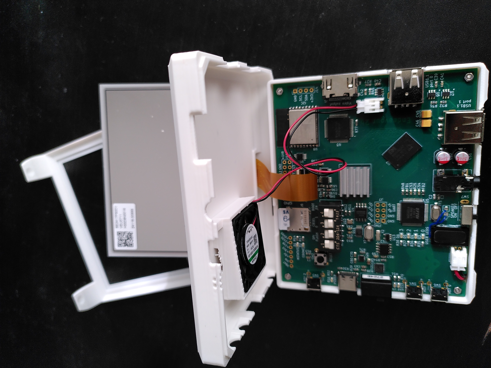

---

## RTL

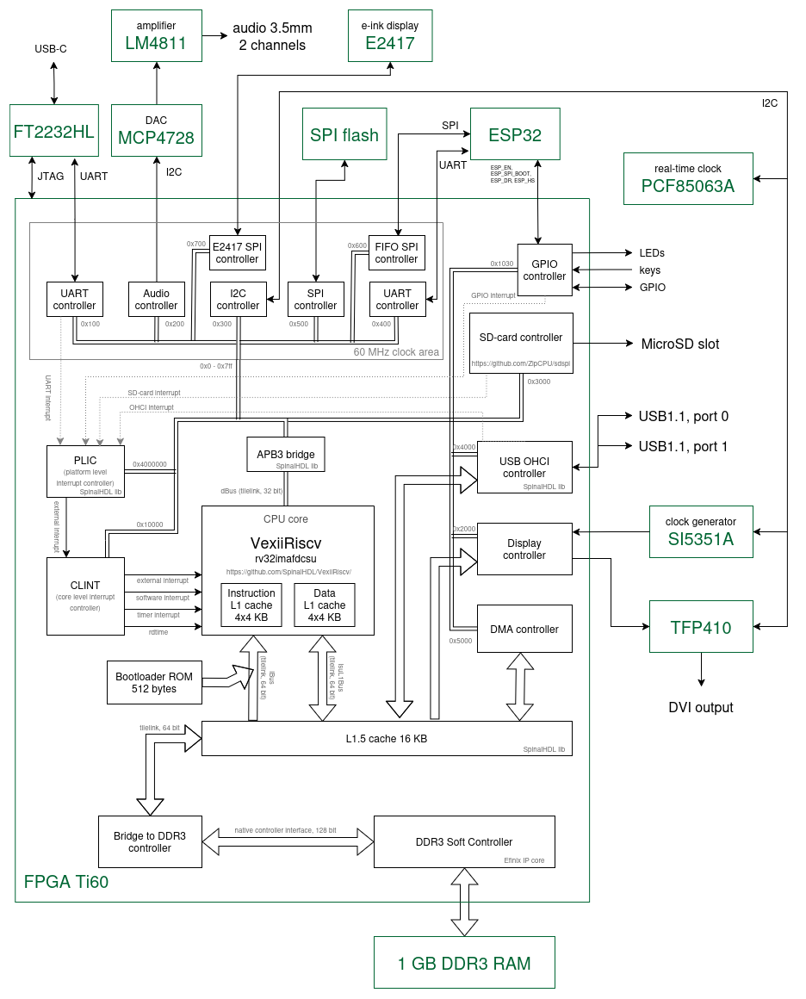

Used IP cores:

- [VexiiRiscv](https://github.com/SpinalHDL/VexiiRiscv/) - RISC-V core written in SpinalHDL.
- A few components distributed with [SpinalHDL](https://github.com/SpinalHDL/SpinalHDL) including Tilelink interconnect, APB3 bridge, USB OHCI controller, PLIC.
- [ZipCPU/sdspi SD-Card controller](https://github.com/ZipCPU/sdspi).
- [Efinix DDR3 Soft Controller Core](https://www.efinixinc.com/support/ip/ddr3-controller.php) (source not available, can be used only with Efinix FPGAs).

All the other components are designed from scratch.
DDR3 Tilelink adapter, UART controller, I2C controller, audio controller, SPI controllers (SPI FLASH, ESP32 SPI, and E2417 SPI interfaces have different requirements, so I end up with 3 different SPI controllers optimized for specific use cases), etc. Most notable are video controller and DMA controller.

[SpinalHDL](https://github.com/SpinalHDL/SpinalHDL) is being used to bring this all together.

### Video controller

- Has idependent text and graphic layers with transparency support.
- Configurable video timings.
- Supports both vertical (with wraparound) and horizontal panning.
- Graphic layer uses RGB565 format.
- Text layer has configurable charmap with 480 entries - e.g. ASCII + bold + italic variations + pseudographics can be loaded at the same time. Supports bitmap fonts with sizes from 8x8 to 8x16. Supports special 4-color symbols mode (used to render Endeavour logo, see screenshots below).
- APB3 control interface, Tilelink DMA interface.
- Implemented in verilog. [source](rtl/verilog/video_controller.v)
- There is [linux driver](software/linux/drivers/display.c). See usage in [include/endeavour2/display.h](software/include/endeavour2/display.h).

### DMA controller

- Can execute multiple memory operations by a single batch request from CPU (needed e.g. for hardware-accelerated window move in X11 since each line requires separate copying).
- Supports unaligned memset and memcpy (also essential for window move).
- Supports some graphics-related instructions: batched RGB565 mixing and palette mapping. So it is kind of a very primitive 2D GPU. I used it to speedup rendering in Quake2.
- APB3 control interface, Tilelink DMA interface.
- Implemented in SpinalHDL. [source](rtl/src/main/scala/endeavour2/DmaController.scala)

## Software

### [software/bios](software/bios)

Firmware. Initialization, benchmarks, sbi, bootloader, etc. Loaded on boot from SPI flash or via UART.

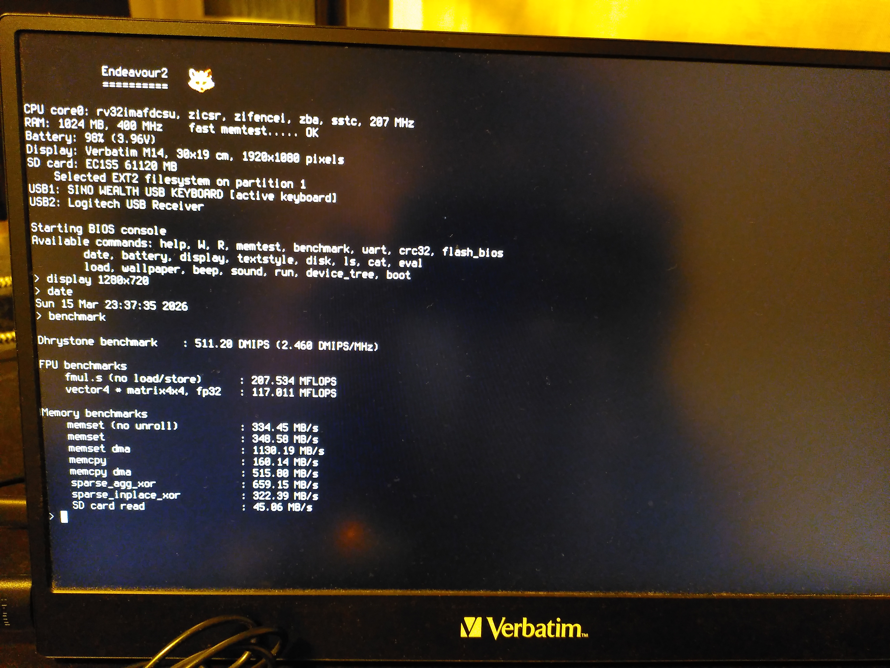

BIOS console allows to either boot OS (switches to supervisor mode), or inspect files (only EXT2 supported) and run binaries in machine mode.

BIOS provides API: [bios.h](software/include/endeavour2/raw/bios.h)

Example that uses this API: [hello_world.c](software/raw_examples/hello_world.c)

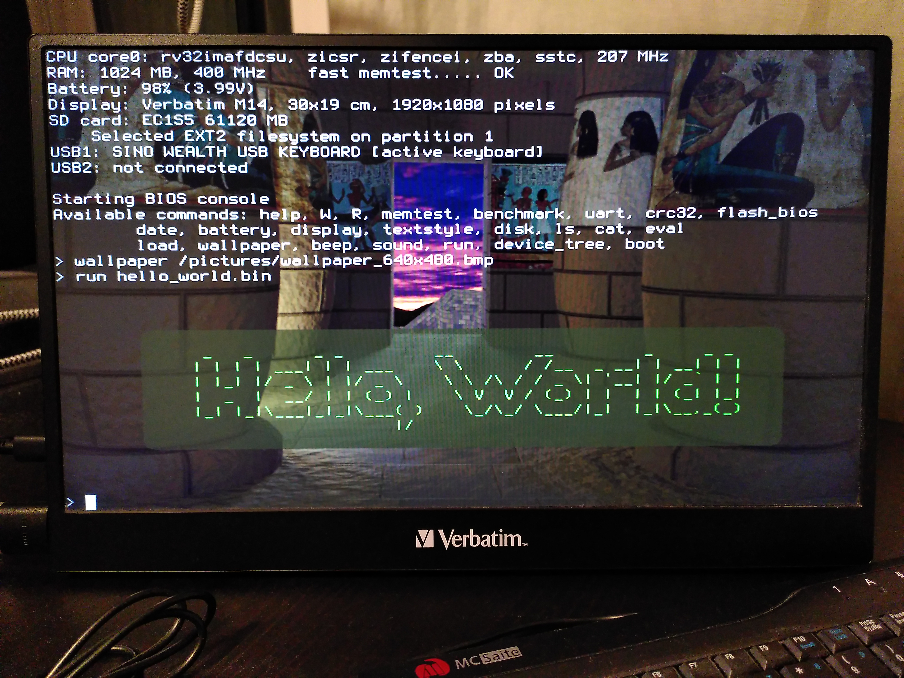

### [software/textwm2](software/textwm2)

Text-layer window manager and TTY implementation.

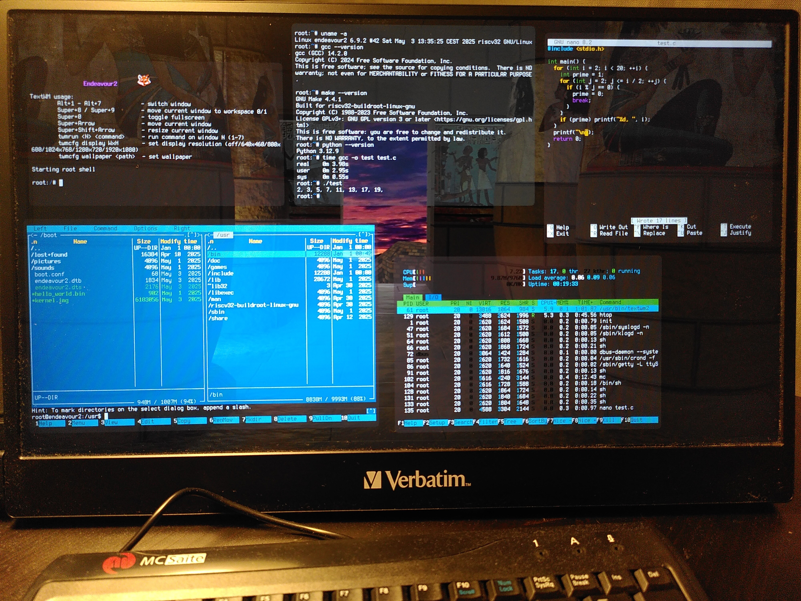

---

**wget 926 KB/s**, ESP32 as WiFi/BT adapter.

### [software/linux](software/linux)

Linux kernel config and drivers.

### [software/buildroot](software/buildroot)

Buildroot config and a few related scripts.

### [xdriver-endeavour2-fbdev](software/buildroot/xdriver-endeavour2-fbdev)

X11 driver which uses DMA controller when moving windows.

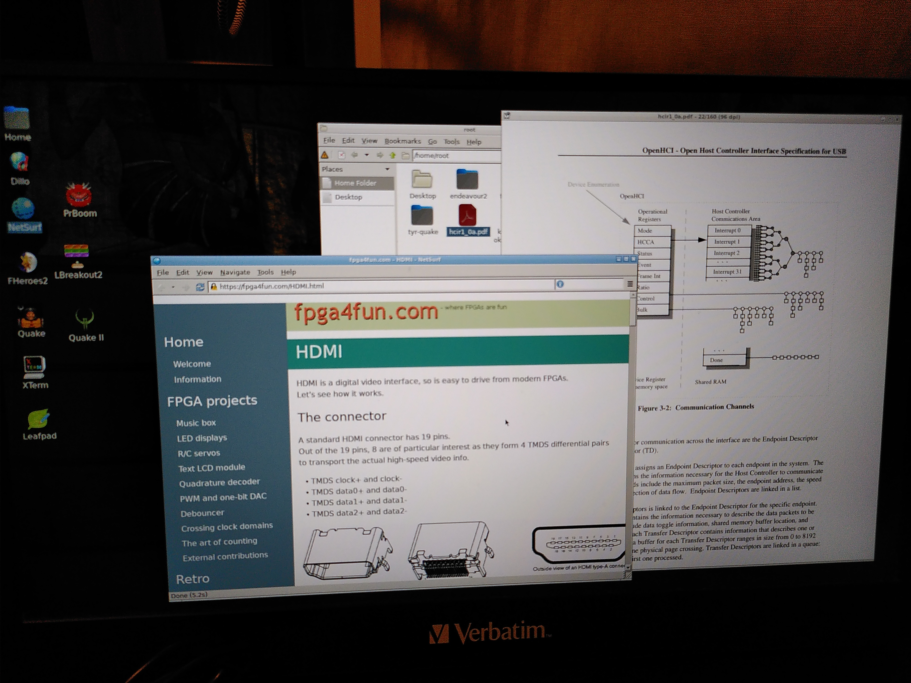

### [quake2sdl.patch](software/buildroot/quake2sdl.patch)

Patch for [quake2sdl](https://github.com/shamazmazum/quake2sdl).

- Using DMA controller for hardware-accelerated mapping from 256 colors to RGB565, and bilinear upscaling.
- Migrated from SDL audio to a custom endeavour2 driver with lower overhead (overhead of ALSA subsystem was quite significant).
- Downgraded from SDL2 to SDL1 (so it can run without X11).

Average FPS 12.2 on demo1 map with resolution 640x360 and bilinear upscaling to 1280x720.

### A few more screenshots

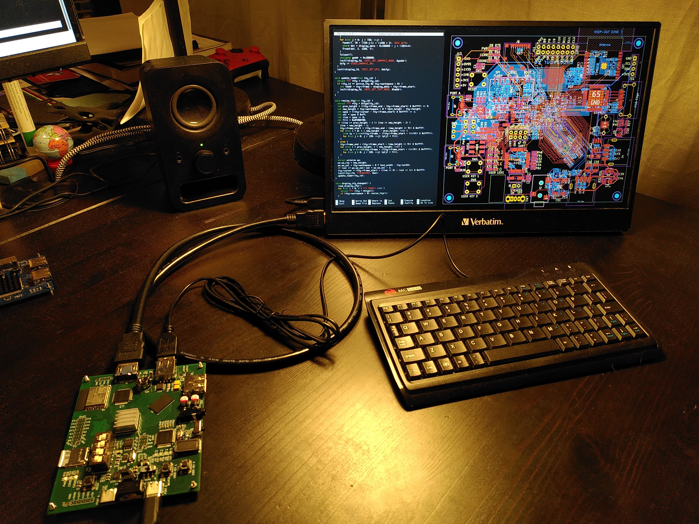

---

**DOOM**

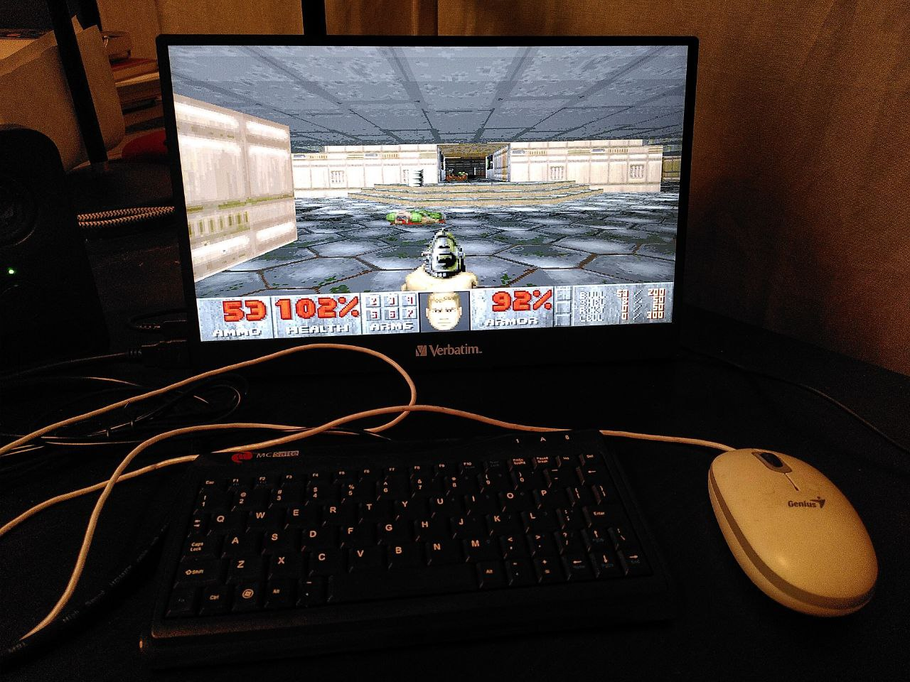

---

**Quake 1**

---

**Heroes2**

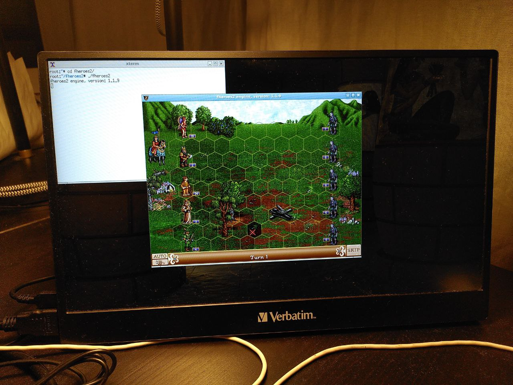

---
