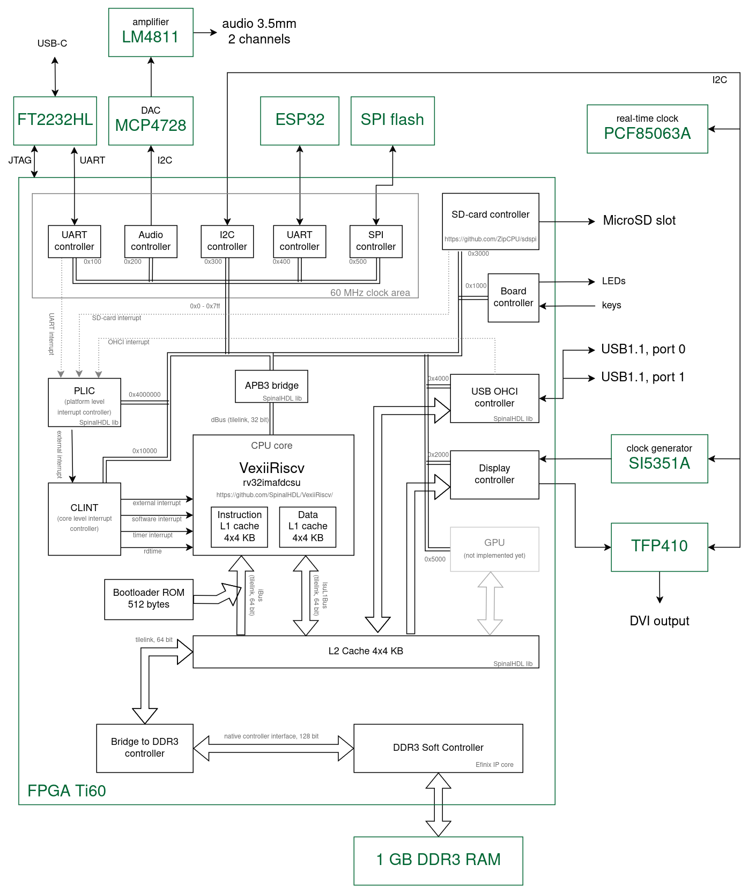
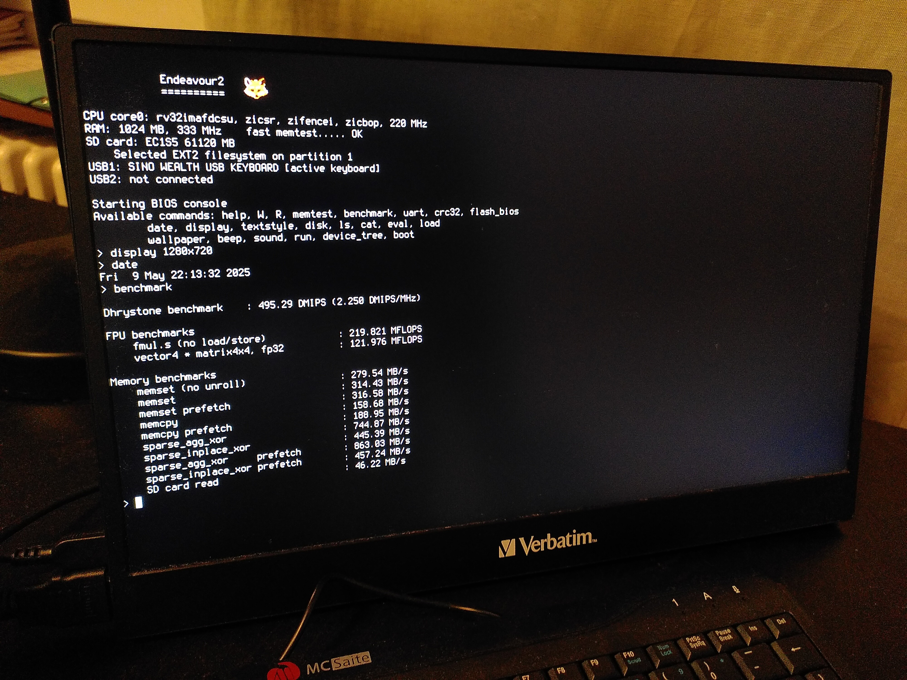

Endeavour2
==========

It is second generation of my FPGA board.
Comparing to [endeavour1](https://github.com/petrmikheev/endeavour) it is 4 times faster and has 8x more memory.

The goal is the same as on the previous iteration -- to make a DIY computer based on FPGA. It should support display, keyboard, should be able to run Linux, should have on-device compiler toolchain, and ideally should be able to render some 3D graphic.

The project includes several parts:

- Hardware: design PCB and make the board. I ordered PCB manufacturing in JLCPCB, soldering is done manually.
- RTL: design SoC for my FPGA board. It is mostly assembled from open source IP cores, but some components are implemented from scratch.
- Firmware: written from scratch (except of integrated Dhrystone benchmark), includes initialization code, memtest, sbi implemetation, ext2 filesystem support, linux bootloader, built-in console. Provides some API (e.g printf) for software running in M-mode.
- Linux drivers for custom peripherals.
- Custom window manager and TTY implementation.

Note: it is a hobby project made just for fun. It does not have much practical use. I don't expect a lot of interest in reusing my code -- at least because using it requires manual soldering. But if for some reason somebody wants to make a copy of this FPGA board -- let me know, I might add a bit more documentation and refactor ugly parts of the code.

## Hardware

Main changes comparing to [endeavour1](https://github.com/petrmikheev/endeavour):

- This time I took a chance with BGA (Ball Grid Array) chips, and surprisingly soldering was not as hard as I expected.
- Using Efinix FPGA [Ti60F256](https://www.efinixinc.com/shop/ti60.php) with 60K logic cells and 256 1024x10b memory blocks. VexiiRiscv runs on this chip at frequency 220 MHz -- quite a lot for FPGA, especially in comparison to 60 MHz which I previously got with Intel Max10.
- 1GB DDR3 RAM IM8G16D3FFBG (against 128MB DDR1 in endeavour1). I planned to use it with Efinix DDR3 Soft Controller Core at 400 MHz frequency (i.e. 800 MT/s, max theoretical throughput 1.6 GB/s), but on high load there were memory errors. Still don't understand why -- either I did PCB routing incorrectly, or maybe the hardcoded DDR timings in the Soft Controller are not compatible with memory chip I use. However reducing frequency from 400 MHz to 333 MHz fixed the problem. At 333 MHz max potential throughput is 1.33 GB/s. In practice in benchmarks I get about 850-900 MB/s at best.
- Implemented SD Card voltage switch 3.3V/1.8V. In theory it allows to use UHS-1 cards in SDR104 mode (up to 100 MB/s), but for some cards writes failed at this speed, so I use SDR50 (46 MB/s in benchmark).
- Added specialized TMDS encoder TFP410 (in endeavour1 video output was driven directly by FPGA pins which provided not enough current and caused green artifacts in some cases). Now all display modes with pixel rate up to 165 MHz are supported.
- Added current limiting scheme to USB ports. Now USB hotplug can not cause device reset!
- Added real time clock with a battery in order not to appear in 1970 every time I start linux.
- Added ESP32 module. Plan to connect it to WiFi and use as a modem via serial port. Not tested yet.

[KiCad project](hardware/board_2a), [gerber files](hardware/board_2a/production/endeavour2.zip).

**PCB production details ([JLCPCB](https://jlcpcb.com/capabilities/pcb-capabilities))**

- 6 layers
- Stackup: JLC06161H-3313
- Min via hole/diameter: 0.2/0.35mm
- Via covering: epoxy filled & capped

## RTL

Used IP cores:

- [VexiiRiscv](https://github.com/SpinalHDL/VexiiRiscv/) - RISC-V core written in SpinalHDL.
- A few components distributed with [SpinalHDL](https://github.com/SpinalHDL/SpinalHDL) including Tilelink interconnect, APB3 bridge, USB OHCI controller, PLIC.
- [ZipCPU/sdspi SD-Card controller](https://github.com/ZipCPU/sdspi).
- [Efinix DDR3 Soft Controller Core](https://www.efinixinc.com/support/ip/ddr3-controller.php) (source not available, can be used only with Efinix FPGAs).

All the other components are designed from scratch. Most notably video controller (has independent text and graphic layers with transparency support) and peripheral controllers.

[SpinalHDL](https://github.com/SpinalHDL/SpinalHDL) is being used to bring this all together.

## Software

### [software/bios](software/bios)

Firmware. Initialization, benchmarks, sbi, bootloader, etc. Loaded on boot from SPI flash or via UART.

BIOS console allows to either boot OS (switches to supervisor mode), or inspect files (only EXT2 supported) and run binaries in machine mode.

BIOS provides API: [bios.h](software/include/endeavour2/raw/bios.h)

Example that uses this API: [hello_world.c](software/raw_examples/hello_world.c)

### [software/textwm2](software/textwm2)

Text-layer window manager and TTY implementation.

---

---

---

